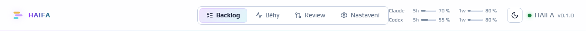

# Codex, roster a živé limity

`factory config roster show` ukazuje efektivní **lokální** harness, model a thinking
každého agenta z `.factory/agents.yaml`. Agent dědí hodnoty z `defaults`, jeho vlastní
hodnoty je přepíší. Přepisy na kroku workflow mají při běhu poslední slovo. Běhy dál
čtou konfiguraci z commitnutého base; lokální změnu zahrne až existující
`factory config commit`. Backlog ani workflow se při přepnutí nepřepisují.

```sh
factory config roster show --repo PATH --json
# Všichni Codex: gpt-6.1-sol / medium
factory config roster set codex --repo PATH --dry-run --json
factory config roster set codex --repo PATH --json
# Všichni Claude: claude-opus-5-5 / medium
factory config roster set claude --repo PATH --json
# Smíšený roster: Claude reviewer, Codex builder
factory config roster set claude --repo PATH --json
factory config roster set codex --agent builder --repo PATH --json
factory config roster set claude --agent reviewer --repo PATH --json
# Explicitní nastavení přepíše preset
factory config roster set codex --agent builder --thinking high --json
factory config roster set --agent builder --harness codex --model gpt-6.1-sol --thinking medium --json
factory config status --json
factory config commit --dry-run --json
factory config commit --json
```

Celkový preset nastaví všechny tři hodnoty v defaults a odstraní jen per-agent
`harness`/`coding_agent`, `model`, `thinking`. Zachová purpose, prompts, writes a další
pole. Preset s `--agent` mění pouze pojmenovanou roli. Bez presetu explicitní přepisy
mění jen zadané hodnoty; při změně harnessu proto zadejte také odpovídající model.
Neznámý agent, nekompatibilní model nebo neplatné thinking zápis zablokují.
Validace používá offline resolvery existujících adapterů (pi svůj lokální katalog).
Přijetí ID neověřuje dostupnost modelu na účtu. Zápis je atomický; `--dry-run` vrátí
stejný plán a diff bez zápisu. Běžné blokové YAML zachová okolní komentáře. U flow
mapování, složitých aliasů či jiných nepodporovaných struktur se použije původní
PyYAML serializer s upozorněním v odpovědi; zkontrolujte diff.

GPT-6.1-Sol má kontext 1 050 000 tokenů a thinking low, medium, high, xhigh, max;
off/minimal nepodporuje. Starší Codex modely zachovávají původní mapování thinking.
Ověřeno proti lokálnímu Codex CLI 0.160.0 přes nápovědu, bez modelového tahu.
Na Windows adapter spouští nativní binárku oficiálního npm balíčku přímo, aby
JSON/TOML uvozovky a prompt neprocházely přes cmd shell. Jiná instalace může nastavit
`CODEX_PATH` přímo na `codex.exe`. Procesy jsou skryté.

Dashboard čte Codex limity přes `codex app-server --stdio`: handshake
`initialize` → `initialized` → `account/rateLimits/read`. Nevytváří vlákno ani
modelový tah, nečte ani nezobrazuje auth tokeny. Vybere bucket `codex` z
`rateLimitsByLimitId`, je-li mapa dostupná, jinak `rateLimits`. Pouze okna dlouhá
300 a 10080 minut dostanou označení 5h a 1w. Ukazuje zbývající procenta a reset
v tooltipu; při smíšené konfiguraci oba poskytovatele ve svislých řádcích:
Claude nahoře, Codex dole, každému vedle názvu 5h a 1w. Okna se mohou
v rámci řádku zalomit, aby nepřekrývala ovládací prvky topbaru.

Čtení má timeout 8 sekund a ukončí dítě i při chybě. App-server 0.160.0 nemá
`--ignore-user-config` (exec jej používá); čtečka přepisuje MCP na prázdnou mapu
a vypíná analytics. Cache `LimitsSource` má standardně TTL 60 sekund. Při selhání
vrací poslední měření jako zastaralé se skutečným časem měření. Session logy mohou
sloužit jen jako označený zastaralý fallback; nejsou nové živé měření. Expirovaná
Codex okna se vyřadí, nevytváří se fiktivních 100 % volné kapacity. Bez aktuálních
či dosud platných starších oken topbar ukáže „Codex nedostupné“ a tooltip s důvodem
a doporučením ověřit `codex login` a instalaci CLI.

Oficiální zdroje: [model GPT-6.1-Sol](https://developers.openai.com/api/docs/models/gpt-6.1-sol)
a [protokol app-server](https://learn.chatgpt.com/docs/app-server).



Ukázka topbaru při šířce 1366 px: Claude nad Codex. Hodnoty limitů jsou ukázková data (SAMPLE), nikoli živé využití účtu.
