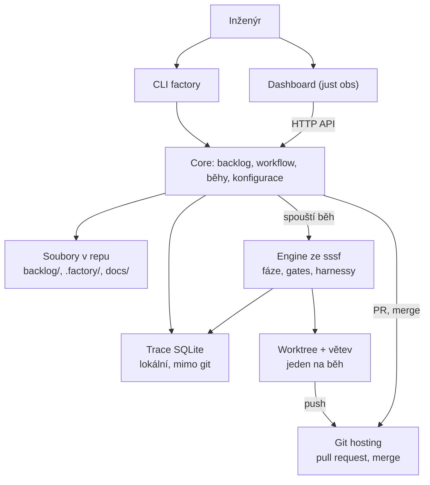
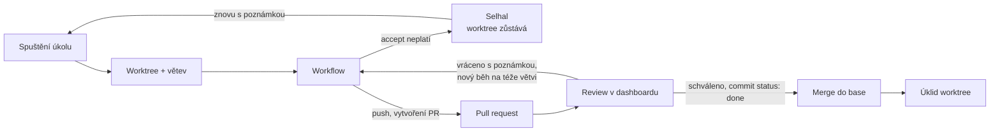
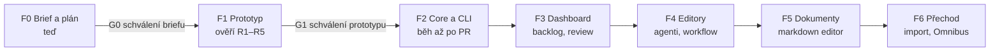

# HAIFA (Helios AI Factory) — product brief a plán

2026-09-26 · Jan · lokální kopie dokumentu https://claude.ai/code/artifact/d943e041-c628-43e2-bbf6-657b9c85e8e0

AI Factory je lokální řídicí panel a CLI nad enginem ze sssf: backlog v markdownu v repu, workflow přiřazené k úkolům, každý běh ve vlastním worktree zakončený pull requestem, který se schvaluje a merguje z dashboardu. Dokument navrhuje rozsah, architekturu a plán s prototypem před vývojem.

## Problém

sssf spolehlivě provede jeden úkol, ale projekt se 100+ úkoly v něm řídí člověk ručně přes soubory a terminál. Omnibus (6 fází, desítky úkolů) ukazuje konkrétní bolesti:

1. **Jeden úkol leží ve čtyřech souborech.** Prompt v `ANALYSIS/phase-NN/task-N.M.md`, volba workflow v `ANALYSIS/phase-NN.md`, specifikace v `IMPLEMENTATION/phase-NN.md`, stav v `IMPLEMENTATION/backlog.md`.
2. **Stav se přepisuje ručně.** Tabulka s emoji v `backlog.md`, kterou upravuje člověk i builder. Vazby mezi úkoly jsou jen věta pod tabulkou.
3. **Běh blokuje repo.** `commit_all` commitne celý strom, takže během běhu se nesmí nic editovat a paralelní běhy nejdou.
4. **Výstupy se jmenují podle session.** `specs/<adw_id>_<slug>.md`, `app_docs/<adw_id>_<slug>.md`, `sessions/<adw_id>/`. K úkolu se dohledávají ručně.
5. **Engine je zkopírovaný v každém repu.** `install.py` razí `adws/` do repa a Omnibus drží vlastní `scripts/update-skill.sh`. Opravy se šíří ručně.
6. **Nastavení jen v souborech.** Agenti, prompty a workflow se mění v YAML, Markdownu a Pythonu. Visualizer je jen ke čtení.
7. **Žádná kontrola před merge.** Workflow commitne přímo na aktuální větev. Chybí krok, kde člověk výsledek schválí.

## Cíl a rozsah

AI Factory umožní jednomu inženýrovi řídit desítky paralelních agentních úkolů v jednom repu tak, že každý úkol má jedno místo v backlogu, běží izolovaně a do hlavní větve se dostane jen přes schválený pull request.

**Uživatelé:** tým, kde každý modul vlastní jeden inženýr, například při migraci 20 modulů z VB6 do .NET. Vlastník plánuje, spouští a schvaluje svůj modul na svém stroji. Koordinace běží přes git a hosting.

**V rozsahu:**

- Backlog v markdownu v repu: úkoly, vazby, přiřazené workflow. Ovládaný z CLI i z dashboardu.
- Běh úkolu: worktree, workflow, pull request, schválení, merge.
- Dashboard (`just obs`): nastavení projektu, backlog, běhy a trace, editory promptů, agentů a workflow, prohlížeč a editor dokumentace a specifikací.
- Ovládání AI agentem: `factory --skill` vypíše skill pro použití HAIFA (příkazy, formáty, postupy) a všechny příkazy umí `--json`.
- Engine ze sssf: fáze, typované envelopes, gates, `writes:` enforcement, harnessy Claude Code, Codex a pi (každý krok workflow může běžet na jiném), SQLite trace.

**Mimo rozsah (verze 1):**

- Vlastní správa uživatelů a oprávnění. Identitu a schvalování řeší hosting (GitHub, Azure DevOps).
- Hostovaný server nebo cloudové běhy. Vše běží lokálně u vlastníka modulu.
- Plánovač napříč moduly. Verze 1 má jen auto-continue v rámci modulu (D10).
- Grafický (drag-and-drop) editor workflow. Verze 1 edituje strukturovaně.
- Generování backlogu a naprogramovaný import. Plán vyrobí skilly `code-dissection` a `implementation-plan`, do backlogu ho převede agent podle postupu z `factory --skill`.

## Co převezmeme ze sssf a co změníme

Jádro sssf zůstává: kód řídí pořadí, retry a akceptaci, agent pracuje v ohraničené fázi. Mění se vše kolem něj.

| Oblast | sssf dnes | AI Factory |
| --- | --- | --- |
| Fáze, envelopes, gates | `adw_modules/runner.py`, `data_types.py`, `gates.py` | převzato beze změny principu |
| Omezení zápisů | `writes:` per agent, `permissions.py` | převzato, navíc `writes` per úkol |
| Harnessy | pi + Claude Code, harness se odvozuje ze jména modelu | převzato, navíc Codex (`codex exec --json`). Harness se zapisuje výslovně u agenta a jde přepsat u kroku workflow |
| Trace | SQLite `sssf.db`, polling UI | převzato, přibude vazba session → úkol → PR |
| Distribuce enginu | kopie `adws/` v každém repu | jeden balíček (`uv tool install`), v repu jen konfigurace a data |
| Workflow | Python skripty `adw_*.py` + lineární `adw_compose` chain | YAML soubory se smyčkami a podmínkami, editovatelné v dashboardu |
| Backlog | není (jen návod v SKILL.md) | markdown soubor na úkol, vazby, přiřazené workflow |
| Běh | v hlavním checkoutu, commit na aktuální větev | worktree + větev na běh, konec = pull request |
| UI | visualizer jen ke čtení (Vue 3 + Bun) | řídicí panel s editory, stejný stack |
| Pojmenování výstupů | podle `adw_id` | podle úkolu: `<task-id>/…`, `adw_id` jen v trace |

## Architektura

CLI i dashboard volá jedno core v Pythonu. Pravdou jsou soubory v repu, SQLite drží jen běhovou telemetrii.



- **Core** (Python balíček `aifactory`): načítání a zápis backlogu, validace workflow, spouštění běhů, práce s gitem a PR. CLI `factory` i API server jsou tenké vrstvy nad ním. CLI je psané i pro agenty: `--json` výstup, stabilní návratové kódy, `factory --skill`.
- **Engine**: `adw_modules` ze sssf přenesené do balíčku. Nově interpretuje workflow z YAML místo Python skriptů.
- **Dashboard**: Vue 3 frontend z visualizeru, rozšířený o editory. Backend přejde z Bunu na Python, aby logika backlogu nebyla ve dvou jazycích (viz D3).
- **Soubory v repu**: `.factory/config.yaml` (nastavení), `.factory/agents.yaml`, `.factory/prompts/<agent>/{system,user}.md`, `.factory/workflows/*.yaml`, `backlog/**/*.md`, cesty ke specs a docs podle nastavení.
- **Trace**: `sssf.db` převzatá, mění se jen přidáním tabulek pro běhy úkolů a PR. Nesdílí se přes git.

## Backlog v markdownu

Backlog je strom adresářů modul → step → task, stejně jako výstup `implementation-plan`. Spouští se task: jeden markdown soubor s YAML hlavičkou. Jeden soubor na task znamená, že paralelní PR nekolidují na společné tabulce.

```markdown
---
id: M07-S02-T03
title: Migrace hlavičky faktury
status: todo
workflow: plan-build-test-review
depends_on: [M07-S01, M03-S01-T02]
writes: [src/Invoicing/, src/Common/Tax/]
---

## Zadání
Co, kde, hotovo znamená, mimo rozsah, pevné omezení.

## Běhy
<!-- doplňuje HAIFA při schválení PR -->
```

**Umístění:** `backlog/<modul>/<step>/<task>.md`, např. `backlog/M07-invoicing/S02-hlavicka/M07-S02-T03-hlavicka-faktury.md`. Adresář modulu i stepu má `index.md` s popisem a výchozími hodnotami pro tasky pod ním: vlastník (modul), `source`, `target`, testovací příkaz, workflow. Názvy a počet úrovní jsou v konfiguraci (`levels: [module, step, task]`), takže jiný projekt může mít jinou hloubku.

**Vazby:** v souboru se ukládá jen `depends_on` (a volitelně `related`). Závislost může mířit na task i na step. Step je hotový, když jsou hotové všechny jeho tasky. „Blokuje“ je opačný směr téže vazby a dashboard ho dopočítá. Dva zápisy téže věci by se rozcházely. Cykly a odkazy na neexistující položku odhalí validace (`factory backlog check`, pre-commit, dashboard).

**Stav:** v souboru jsou jen trvalé stavy, běhové stavy žijí lokálně.

| Stav | Kde žije | Kdo ho mění |
| --- | --- | --- |
| todo, cancelled | hlavička souboru | člověk (CLI, dashboard) |
| ready, blocked | dopočítáno z `depends_on` | nikdo, plyne z vazeb |
| running, failed, in review | trace DB + git hosting | běh a PR |
| done | hlavička souboru | commit do PR při schválení, do `main` přijde merge |

Při schválení v dashboardu přidá HAIFA do PR jeden commit: `status: done` a záznam do sekce Běhy (datum, workflow, odkaz na PR, náklady). Hned potom merguje. Kód i stav tak přijdou v jednom PR a vrácený nebo zamítnutý PR stav nezmění. Funguje to i se squash merge.

**Ovládání z CLI:** `factory task add|edit|show|list|link|run`, `factory backlog check`, `factory backlog sync`. Každý příkaz umí `--json`. `factory --skill` vypíše skill, podle kterého agent HAIFA ovládá: příkazy, formát backlogu a workflow a postupy (převod plánu do backlogu, spuštění, review). Dashboard používá stejné funkce core.

## Workflow jako data

Workflow je YAML soubor v `.factory/workflows/`. Musí vyjádřit vše, co dnes umí nejsložitější `adw_simple_sdlc.py`: smyčku test → oprava, smyčku review → revize a podmíněné kroky. Lineární `adw_compose` chain nestačí.

```yaml
name: plan-build-test-review
description: Plán, implementace, testy s opravami, review s revizí
steps:
  - plan: { harness: claude, model: opus }   # role z registru: agent + typ výstupu + gates
  - commit
  - build: { harness: codex }                # model z výchozího nastavení agenta
  - repeat: { max: 3, until: test.passed }
    steps: [test, fix]
  - repeat: { max: 2, until: review.approved }
    steps:
      - review: { harness: pi }
      - revise
  - test: { when: revise.ran }
  - commit: { when: test.passed and review.approved }
  - document: { when: test.passed and review.approved }
  - commit
accept: test.passed and review.approved
```

**Konstrukce:** krok (role agenta nebo kódový krok), `repeat` s `max` a `until`, podmínka `when`, `accept` jako akceptační kritérium běhu. Podmínky čtou jen pole typovaných envelopes (`test.passed`, `review.approved`). Žádný volný Python. Každý krok může přepsat harness (`claude`, `codex`, `pi`), model a thinking. Výchozí hodnoty má agent v `.factory/agents.yaml`, takže tentýž builder může v jednom workflow běžet na Codexu a v jiném na Claude.

**Registr rolí** z `roles.py` přejde do `.factory/roles.yaml`: jméno kroku → agent, typ výstupu, gates, popis fáze. Typy výstupů a gates zůstávají v kódu enginu, konfigurace je jen vybírá podle jména.

**Kódové kroky:** `test`, `quality`, `commit`, `changes` jako dnes. Přibude `command` s argv z konfigurace (např. `dotnet test`) a `pr` na konci každého běhu.

**Editace:** dashboard nabídne strukturovaný editor (seznam kroků, výběr role, vnoření do repeat, podmínky z našeptávače), náhled grafu a validaci proti registru rolí a agentů. Surový YAML jde editovat vždy.

**Přechod:** součástí dodávky budou YAML verze stávajících ADW (`plan`, `plan-build`, `plan-build-test`, `simple-sdlc`, `document`, `scout`). Python skripty zůstanou jako typ workflow `script` pro případy, které YAML nevyjádří.

## Běh úkolu

Každé spuštění položky backlogu dostane vlastní worktree a větev z `base`. Končí pull requestem a do `base` se dostane jen po schválení v dashboardu.



1. **Start:** `factory task run M07-S02-T03 [--note …]` nebo tlačítko v dashboardu. Kontrola: task není právě spuštěný a všechny `depends_on` jsou v `base` hotové (přebití s `--force`).
2. **Worktree:** `.factory/worktrees/<run-id>`, větev `factory/<task-id>-<n>`. Trace a session runtime zůstávají v hlavním checkoutu, sdílené všemi běhy.
3. **Workflow:** běží ve worktree. Agent smí měnit jen `writes` tasku, navíc k omezení samotného agenta.
4. **PR:** po splnění `accept` push a vytvoření PR. Popis PR obsahuje zadání, shrnutí agentů, výsledky gates a testů, verdikt revieweru a náklady.
5. **Review:** dashboard ukáže diff, trace a popis. „Schválit“ odešle approve review jménem přihlášeného uživatele, přidá do PR commit se `status: done` a merguje, jakmile to branch protection dovolí. „Vrátit“ spustí nový běh na téže větvi s poznámkou v promptu a PR se aktualizuje.
6. **Konflikt:** když PR nejde mergovat, dashboard to ukáže a nabídne rebase nebo workflow `resolve`.
7. **Úklid:** po merge se worktree smaže. Větev smaže hosting podle svého nastavení.
8. **Auto-continue:** když je u modulu nebo stepu zapnutý, HAIFA po úspěšném běhu (PR vytvořen) spustí další připravený task v pořadí backlogu. Selhání běhu řetěz zastaví. Co dělat s taskem, který závisí na ještě nemergnutém PR, řeší Q9.

Práce s PR je za rozhraním `GitProvider` (vytvořit, stav, merge, komentář). Implementace: GitHub přes `gh`, Azure DevOps přes `az repos` a lokální režim bez remote (větev a diff v dashboardu, merge lokálně).

## Dashboard

`just obs` (nebo `factory obs`) spustí lokální server a otevře dashboard. Obrazovky:

| Obrazovka | Co umí | Zdroj dat |
| --- | --- | --- |
| Backlog | strom modul → step → task a kanban, filtr stavu a vlastníka, graf závislostí, založení a editace tasku, přiřazení workflow, vazby, spuštění, přepínač auto-continue | `backlog/**/*.md` + trace |
| Běhy | běžící a dokončené běhy, fáze, trace, náklady, zastavení běhu | trace (dnešní visualizer) |
| Review | PR mých modulů a PR čekající na mé review, diff, výsledky gates a testů, schválit (approve, commit done, merge), vrátit s poznámkou | git hosting + trace |
| Agenti | model, harness (claude, codex, pi), thinking, tools, `writes`, barva, přiřazené prompty | `.factory/agents.yaml` |
| Prompty | editor `system.md` a `user.md` s náhledem vykreslení proměnných (`{{prompt}}`, `{{previous_envelope}}`) a kontrolou sekce `## Report` proti typu výstupu | `.factory/prompts/` |
| Workflow | strukturovaný editor, volba harnessu a modelu u kroku, náhled grafu, validace | `.factory/workflows/*.yaml` |
| Dokumenty | strom a náhled markdownu, editace, odkazy mezi soubory a na úkoly | cesty specs a docs z nastavení |
| Nastavení | viz níže | `.factory/config.yaml` |

**Nastavení projektu:** pracovní adresář agentů (kořen repa nebo podadresář), adresář backlogu, adresáře specs a dokumentace, adresář worktree, `base` větev, git provider a merge strategie, port dashboardu, cesta k trace DB, výchozí testovací příkaz, chráněné soubory. Port a cesta k DB jsou lokální a patří do `.factory/local.yaml` mimo git. Ostatní se sdílí.

**Zápisy z dashboardu** jdou do souborů v hlavním checkoutu. Běh ale vychází z commitu v `base`, takže necommitnutá změna promptu nebo agenta se do běhu nedostane. Dashboard proto ukazuje necommitnuté změny konfigurace a nabízí je commitnout (viz D4). Soubory se sledují, takže změna z CLI nebo editoru se v dashboardu projeví hned.

## Klíčová rozhodnutí

Třináct rozhodnutí ke schválení. Každé má doporučení a hlavní alternativu.

| # | Rozhodnutí | Doporučení | Alternativa |
| --- | --- | --- | --- |
| D1 | Kde projekt žije | schváleno: nové repo `~/Documents/HAIFA`. sssf zůstává beze změny, Omnibus běží dál | vývoj přímo v repu sssf |
| D2 | Distribuce enginu | balíček instalovaný jednou (`uv tool install`), v repu jen `.factory/` | razit kód do repa jako sssf |
| D3 | Backend dashboardu | Python (Starlette/FastAPI), jedno core pro CLI i UI. Vue frontend z visualizeru | ponechat Bun a volat CLI s `--json` |
| D4 | Změny konfigurace z dashboardu | uložit do souboru, tlačítkem commitnout do `base` | každá změna konfigurace jako vlastní PR |
| D5 | Tvar backlogu | strom modul → step → task (úrovně v konfiguraci), soubor na task, `index.md` na modul a step, uložené jen `depends_on` | jeden soubor s tabulkou |
| D6 | Stav úkolu | trvalý v hlavičce, běhový v trace. `done` přidá jeden commit do PR při schválení, těsně před merge | veškerý stav v souborech s commitem na každou změnu |
| D7 | Workflow | YAML s `repeat`, `when`, `accept`. Python skript jako záložní typ | jen Python ADW + editor lineárních chainů |
| D8 | Pull requesty | rozhraní `GitProvider`: GitHub (`gh`), Azure DevOps (`az repos`) a lokální režim | napevno GitHub |
| D9 | Merge strategie | nastavitelná, výchozí squash | výchozí merge commit |
| D10 | Spouštění úkolů | ručně z CLI nebo dashboardu, plus přepínač auto-continue u modulu nebo stepu: po úspěšném běhu se spustí další připravený task | automatická fronta připravených úkolů s limitem paralelity |
| D11 | Schvalování v týmu | Schválit = approve review v hostingu jménem uživatele + merge, když to branch protection dovolí. Dnes self-approval, později jiný approver beze změny HAIFA. Vlastník modulu v `index.md` | vlastní schvalování v HAIFA mimo hosting |
| D12 | Ovládání agentem | `factory --skill` vypíše skill pro použití HAIFA z aktuální verze kódu. Všechny příkazy umí `--json`. Převod plánu do backlogu je postup ve skillu, ne naprogramovaný import | importer pro formát `implementation-plan` v kódu |
| D13 | Harnessy a volba po krocích | tři adaptéry se stejným rozhraním: Claude Code, Codex (`codex exec --json`), pi. Harness se zapisuje výslovně u agenta a jde přepsat u každého kroku workflow spolu s modelem a thinking | odvozovat harness ze jména modelu jako sssf (nefunguje, Codex i pi mají modely `openai/…`) |

## Rizika

První čtyři rizika rozhodují, jestli návrh funguje. Proto je ověří prototyp dřív, než začne vývoj.

| # | Riziko | Dopad | Ověření nebo zmírnění |
| --- | --- | --- | --- |
| R1 | YAML workflow nevyjádří logiku dnešních ADW | editor workflow nemá smysl, návrat k Pythonu | prototyp přepíše `simple-sdlc` do YAML a porovná trace se starým během |
| R2 | Paralelní běhy mění stejné soubory a PR kolidují | ruční řešení konfliktů, zdržení | prototyp pustí dva úkoly nad sdíleným souborem. Zmírnění: `writes` per úkol, vazby, workflow `resolve` |
| R3 | Stav `done` přes merge PR nesedí s realitou (zavřený PR, merge v GitHubu nebo Azure DevOps mimo dashboard, squash) | backlog lže | prototyp projde všechny cesty PR a zkontroluje soubor v `base`. `factory backlog sync` doplní `done` pro PR mergnuté mimo dashboard |
| R4 | Běh nevidí necommitnutou změnu promptu z dashboardu | „nastavil jsem to, a ono to nefunguje“ | varování v dashboardu před spuštěním, D4 |
| R5 | Worktree na běh je drahý (.NET build, `node_modules`) | disk a čas | prototyp změří. Zmírnění: úklid po merge, sdílené cache |
| R6 | Přenesení enginu rozbije opravy nashromážděné v sssf (rollback zápisů, retry, SIGTERM) | regrese | moduly přenést beze změny logiky, pokrýt testy před úpravami |
| R7 | Dashboard s osmi obrazovkami je velký | rozsah se nafoukne | fázování: nejdřív backlog, běhy a review, editory potom |
| R8 | Firma používá jiný hosting než GitHub | PR krok nefunguje | rozhraní `GitProvider`, GitHub i Azure DevOps od F2 (Q1) |
| R9 | Paralelní běhy násobí náklady na modely | nepříjemná faktura | náklady na úkol a součet v dashboardu, limit na běh v konfiguraci |
| R10 | Codex má jiný proud událostí, jiné nástroje a jiné obnovení session než Claude Code a pi | krok na Codexu se chová jinak, trace je neúplná, opravná kola ztratí kontext | prototyp postaví adaptér Codexu a spustí jeden workflow se třemi harnessy. Kontraktové testy společné pro všechny adaptéry. Omezení zápisů funguje nezávisle na harnessu, protože kontroluje git diff |

## Plán

Vývoj produktu začne až po schválení briefu (G0) a výsledků prototypu (G1). Každá další fáze končí měřitelným kritériem hotovo.



1. **F1 Prototyp.** Úzký, zahoditelný, nad stávajícím kódem sssf. Obsah: načtení markdown backlogu (2 moduly, 3 stepy, 6 tasků s vazbami), interpret YAML workflow s `repeat` a `when`, běh ve worktree až po PR na testovacím GitHub repu, jedna stránka se seznamem PR a tlačítkem Schválit (approve, commit done, merge), auto-continue v rámci stepu, adaptér Codexu a volba harnessu po krocích.
    - Hotovo když: `simple-sdlc` v YAML projde stejnými fázemi jako Python verze. Dva paralelní úkoly skončí dvěma PR. Po merge je `status: done` v `base`. Změřený náklad worktree. Zpráva s výsledky R1–R5 a případnými úpravami rozhodnutí.
2. **F2 Core a CLI.** Balíček `aifactory`, engine přenesený ze sssf s testy, `.factory/` konfigurace, backlog knihovna s validací, workflow interpret, běh s worktree, `GitProvider` (GitHub, Azure DevOps a lokální), YAML verze stávajících ADW, auto-continue, `factory --skill` a `--json` u všech příkazů.
    - Hotovo když: na ukázkovém repu projde z CLI 5 úkolů, z toho 2 paralelně, od `factory task run` po mergnutý PR a stav `done`.
3. **F3 Dashboard základ.** Python backend, Vue frontend z visualizeru, obrazovky Backlog, Běhy, Review a Nastavení.
    - Hotovo když: úkol jde založit, provázat, spustit, sledovat, schválit a mergovat bez terminálu.
4. **F4 Editory.** Agenti, prompty s náhledem a kontrolou `## Report`, workflow se strukturovaným editorem a validací. Commit změn konfigurace podle D4.
    - Hotovo když: nový agent, jeho prompty a workflow s ním vzniknou v dashboardu a běh je použije.
5. **F5 Dokumenty.** Prohlížeč a editor markdownu pro specs a docs, odkazy na úkoly.
    - Hotovo když: specifikace úkolu jde otevřít z backlogu, upravit a commitnout.
6. **F6 Přechod.** Import výstupu `implementation-plan` (sharded markdown: index a odkazované soubory) do stromu modul → step → task jako postup ve `factory --skill`, ověřený agentem na skutečném plánu a `factory backlog check`, převod Omnibusu (backlog tabulka → soubory, ADW → YAML), návod.
    - Hotovo když: Omnibus nebo VB6 migrace běží na AI Factory a sssf u něj už není potřeba.

Pořadí F3 až F5 jde upravit podle toho, co bude nejdřív potřeba pro migraci. F2 je předpoklad pro všechno ostatní.

## Otevřené otázky

Všechny otázky jsou zodpovězené (2026-09-26).

- [x] **Q1** Git hosting: GitHub a Azure DevOps. Lokální režim zůstává pro prototyp a testy.
- [x] **Q2** „Cesta k databázi backlogu“ je adresář backlogu. Jediná databáze je lokální trace.
- [x] **Q3** Nové repo `~/Documents/HAIFA`, název HAIFA (Helios AI Factory).
- [x] **Q4** Prototyp na testovacím repu.
- [x] **Q5** Tým, jeden člověk vlastní jeden modul (D11).
- [x] **Q6** Branch protection vyžaduje jednoho approvera, dnes smí schválit i autor. Později může přibýt jiný tým s jiným approverem (D11).
- [x] **Q7** Tři harnessy: Claude Code, Codex a pi, volitelné pro každý krok workflow (D13).
- [x] **Q8** Výstup `implementation-plan` jsou sharded markdowny: index a odkazované soubory. Import je bude procházet podle odkazů.
- [x] **Q9** Auto-continue narazil na task, který závisí na předchozím, ještě nemergnutém PR. Rozhodnuto: počkat na schválení a mezitím spustit task, který spustit jde.
- [x] **Q10** Ukázka plánu není potřeba. Převod dělá agent podle postupu ve `factory --skill` (D12).
